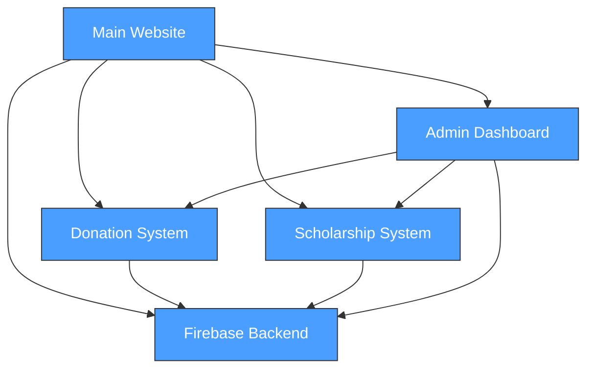

# Project Architecture

## Overview
The Make A Splash Foundation website is a Firebase-hosted static website that supports the nonprofit's mission to provide swim lesson scholarships. The site handles donation processing (Stripe/PayPal), scholarship applications, donor recognition, and administrative functions.

## Design Principles
- Static-first: HTML/CSS/JS with Firebase backend services
- Mobile-responsive design for accessibility
- Secure payment processing through established providers
- Simple, maintainable codebase without complex build tools

## Component Map

> Auto-generated from `.project/architecture/components.json`
> Run `/sync architect` to regenerate

## Key Pages
- `index.html` - Homepage with mission and calls to action
- `apply.html` - Scholarship application form
- `donate.html` - Donation page with payment integrations
- `admin.html` - Administrative dashboard
- `donors.html` - Donor recognition wall
- `corporate-partners.html` - Corporate sponsor information
- `resources.html` - Swimming resources and information

## Constraints
- Firebase free tier limits (consider for scaling)
- Static hosting (no server-side rendering)
- Payment processor fees and requirements

## Technical Decisions
See also `decisions.md` for detailed rationale.

| Decision | Choice | Date |
|----------|--------|------|
| Hosting | Firebase Hosting | Pre-existing |
| Database | Firestore | Pre-existing |
| Payments | Stripe + PayPal | Pre-existing |
| Build Tools | None (vanilla HTML/CSS/JS) | Pre-existing |
